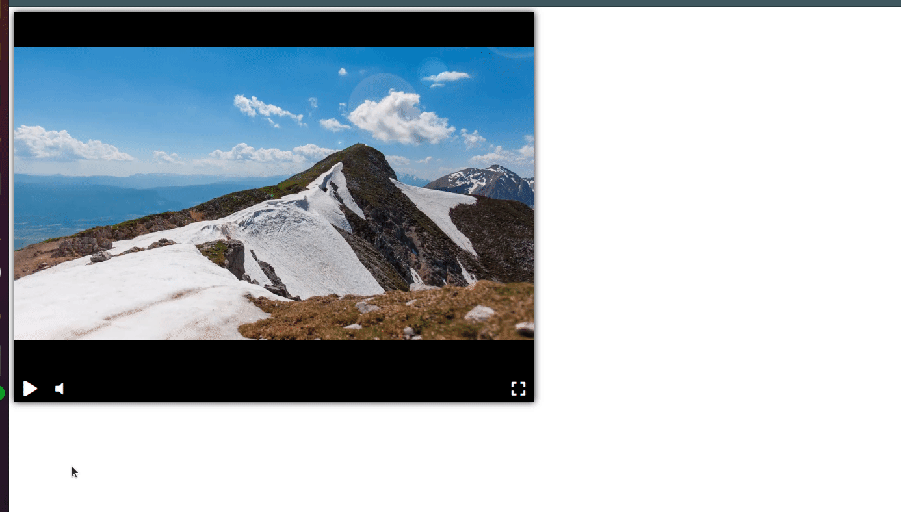

<!-- Плеер будет создан с задержкой, после того как загрузятся все ресурсы на странице. Для этого используется событие `DOMContentLoaded`. Благодаря этой особенности можно вызывать функцию `createPlayer` раньше, чем загрузятся все необходимые библиотеки: jQuery и Playable.
 -->

# Видеоплеер

Кастомный видеоплеер, созданный в рамках учебного проекта.

Построен на базе библиотеки [Playable](https://wix.github.io/playable/).

## Примеры

- Страница с видеоплеером на [Github Pages](https://shirlusha.github.io/video-player-jslib/)

## Как подключить

Для работы с видеоплеером необходимо скачать репозиторий и запустить страницу index.html

## Цели проекта

Код написан в учебных целях — это урок в курсе по Python и веб-разработке на сайте [Devman](https://dvmn.org).